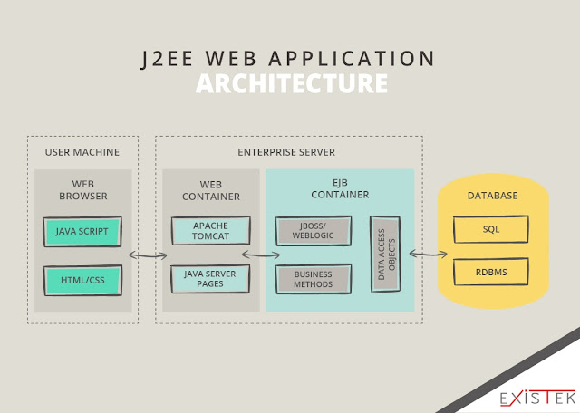

# - 초고 - 

한국에서 오랫동안 널리 그리고 지금도 이용되고 있는 Java Web Application Architecture다. 
아무래도 한국에서 유명한 이유는 한국에 Java 개발자가 많기 때문이 아닐까 싶다.
B2B 시장에서는 더 높은 비율로 이용되고 있다.
* 기업에서 만든 어플리케이션은 대략 10년 주기로 차세대 개발을 진행을 한다. 아직 대부분은 이런구조를 이용하고 있으며 차세대를 한다고 하더라도 node.js 아키텍쳐로 가긴 어려움이 많을것으로 추측한다.

>Ruby On Rails 웹 어플리케이션 서버아키텍쳐(Ruby on Rails Web Server Application Architecture), 
Python 웹 어플리케이션 서버아키텍쳐(Django Web Application Server Architecture)도 많이쓰이지만 
아쉽게도 필자는 엔터프라이즈 어플리케이션 위주의 경험들뿐이라 써볼 기회가 없었다.

제법 오랫동안 이구조를 사용했는데 대부분 webserver로는 'apache'를 was로는 tomcat을 많이 이용했다. WebtoB에 Jeus구조를 이용한적도 있지만 몇번 써봤다정도지 그게 큰의미는 없다.
DBMS는 Oracle,Mysql,Mssql,Tibero 등 다양하게 이용했던것 같다.
각자 하는 역할에 대해서 간단하게 알아보자.

>내용들은 웹개발자라면 깊이 알진 못해도 가볍게 알아야 되는정도로만 다뤄보겠다. 각각에 대한 설명을 깊게들어가면 그것만으로도 분량이 엄청나다. 
그리고 필자보다 훨씬 뛰어난분들께서 선행적으로 잘 정리해주신게 있으니 가볍게 보도록 하자. 

## 1. Browser
- - -
사용자와의 상호작용을 해주는 매체이다. WAS에서 생성된 ui를 랜더링 해서 표시해준다.
사용자의 요청을 request 하고 response 받는다.
MS진형에서 Internet explorer가 오랫동안 사용되었으나 여러문제로 인해 Edge로 대체되었고 mac에서는 apple의 safari가 주로 이용되고 있다.
범용적으로는 구글진형의 크롬이 쓰이고 있고 그로 인해 점유률 1위는 현재 크롬이다. firefox, naver에서 만든 whale등도 상당히 괜찮은 브라우저로 손꼽힌다.

## 2. Web server
- - -
정적인 컨텐츠(Html, Css, Jpeg 등)를 제공한다. 브라우저의 요청을 어플리케이션 서버로 위임시킨다. 
오랫동안 Apache를 이용했으며 요즘은 nginx도 많이 사용된다.

## 3. Was 
- - -
동적인 컨텐츠를 제공한다. 요청을 필요에 따라 DBMS에 질의 할수 있고 그정보를 바탕으로 HttpResponse가공하여 WebServer에 전달한다.
전세계적으로 Tomcat을 많이 이용하고 국내에서 Tmax회사의 Jeus를 사용하는 경우를 더러 봤다. JBoss, Web Sphere 등도 있다는것만 알아두자.  

## 정리
- - -
이러한 과정을 문장으로 풀어보자.
사용자는 브라우저를 통해 요청(request)한다. Webserver는 클라이언트의 요청을 WAS로 보낸다. 
Was는 요청에 따라 DB에 질의하여 사용자의 요청에 맞는 동적인 컨텐츠(Servlet 등)를 제공한다. 
내용을 그림으로 아래와같이 정리 해보았다.

> 참조 : https://existek.com/blog/web-application-architecture/
