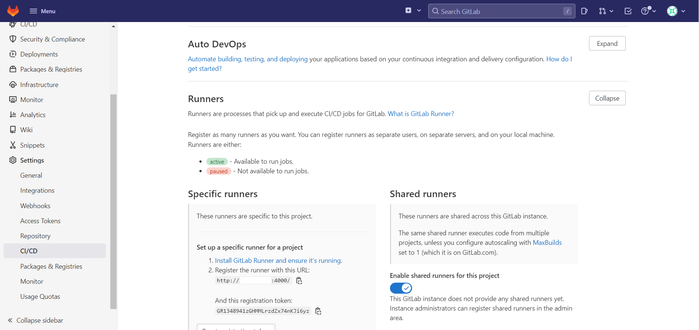

## 1. CI/CD란?

지속적 통합(Continuous integration)/지속적 배포(Continuous Deployment)의 약어로 문자그대로의 의미이다.

* 혹자는 지속적 개발(Continuous Develop)까지 포함된다 한다.

개념 설명을 한번도 안하다가 갑자기 하는것은 해당 개념을 통해 당면한 문제를 해결하기 때문이다.
devops포스팅에서 다루고 있는 Gitlab은 현재 점유율1위로 CI/CD기능을 폭넓게 쓸수 있는 툴이다.
문제를 Gitlab CI/CD를 통해 해결해보자.

## 2. Gitlab CI/CD 사전준비
###2.1 Gitlab runner 설치
<pre>
a. repository 추가
    curl -L "https://packages.gitlab.com/install/repositories/runner/gitlab-runner/script.deb.sh" | sudo bash

b. gitlab-runner 설치
    apt install gitlab-runner
</pre>

###2.2 Gitlab runner 등록
<pre>
a. gitlab project 설정확인
   gitlab 접속(localhost:4000) > Project 선택 > 왼쪽상단 Menu 선택 > Settings 메뉴 > CI/CD > Runner Expand 
</pre>
[그림1] Gitlab CI/CD Runners 정보 확인

<pre>
b. gitlab-runner 등록
    gitlab-runner register
</pre>
[그림1]을  보고 아래와 같이 입력

다시 Gitlab CI/CD Runners 정보로 돌아가보면 아래와같이 초록불을 확인 할 수 있다.

###
