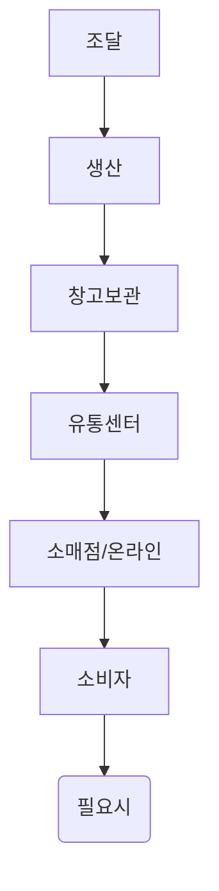
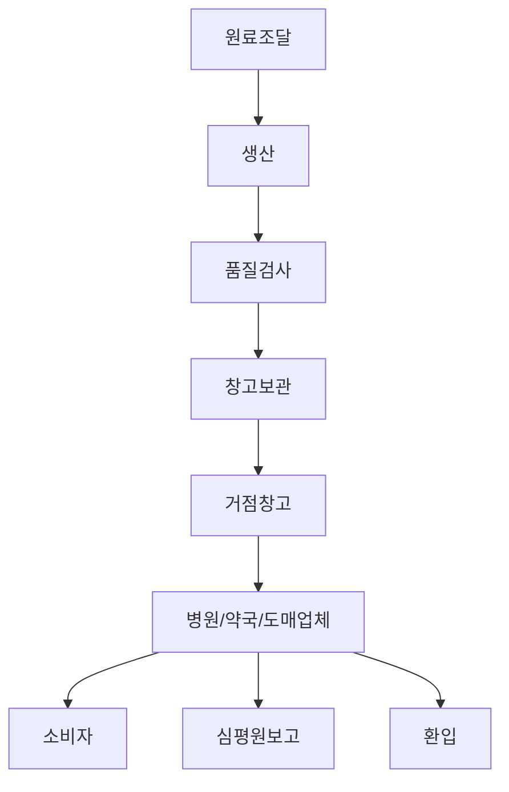

## 1️⃣ 프로젝트 개요
### ✅ 목표
제약사 그룹사의 물류통합을 위해 **현재 프로세스를 분석**하고, BPR(업무 프로세스 재설계)을 통해 **효율성 개선 및 규제 준수 최적화**를 목표로 한다.

### ✅ 분석 범위
- 프로세스 재설계 범위는 **고객의 주문 이후 시점**부터 이다
- **일반 물류 흐름**과 **제약 물류 흐름** 비교
- 물류 프로세스 단계별 주요 차이점 분석
- **WMS고도화, 2D 바코드 관리, 심평원 보고** 등을 고려한 최적화 방안 도출

---

## 2️⃣ 일반 물류 흐름 분석
### 🔹 주요 특징
- **비용 절감, 속도 최적화** 중심
- 일반적인 물류 창고(WMS) 및 운송(TMS) 활용
- **일반적인 품질 관리 적용** (온도·습도 관리 필요 없음)
- **FIFO(선입선출) 방식 사용**

### 📌 단계별 분석

| 단계 | 일반 물류 프로세스 |
|---|---|
| **1. 조달** | 원자재 공급업체로부터 원자재, 부자재 조달 |
| **2. 생산** | 원자재를 투입하여 제품 생산 |
| **3. 창고 보관** | WMS 기반 재고 관리 (온도·습도 관리 없음) |
| **4. 유통센터 이동** | 물류센터에서 도매업체, 소매점으로 배송 |
| **5. 소비자 전달** | 최종 소비자에게 배송 (택배, 오프라인 판매) |
| **6. 반품/회수** | 일반적인 반품 프로세스 적용 |

---

## 3️⃣ 제약 물류 흐름 분석
### 🔹 주요 특징
- **GMP(우수 의약품 제조 기준) 및 GDP(우수 의약품 유통 기준) 준수 필수**
- **의약품 2D 바코드 관리(Serialization) 적용**
- **FEFO(유통기한 기반 출하) 원칙 적용**
- **심평원(건강보험심사평가원) 공급 보고 필요**
- **거점창고(3PL)** 활용 

### 📌 단계별 분석

| 단계 | 제약 물류 프로세스 |
|---|---|
| **1. 원료 조달** | API(원료의약품) 및 부자재 조달 (GMP 품질 검사 필수) |
| **2. 생산** | 무균 생산, QC 검사, 2D 바코드 부여 (Serialization) |
| **3. 품질 검사** | 생산된 제품의 샘플링 검사 후 적격 판정 제품만 창고 입고 |
| **4. 창고 보관** | GDP 준수, **온도·습도 모니터링 필수, FEFO 적용** |
| **5. 거점 창고 이동(3PL)** | **냉장/냉동 제품 콜드체인 관리**, 실시간 온도 추적 |
| **6. 병원/약국/도매업체 출하** | 납품 문서 생성 및 검증, 2D 바코드로 출하 데이터 관리 |
| **7. 소비자 전달** | 병원 및 약국에서 **처방에 따라 의약품 판매** |
| **8. 생산 실적 보고** | 출하된 제품 정보 **심평원 공급 보고 필수** |

---

## 4️⃣ 일반 물류 vs 제약 물류 비교표

| **구분** | **일반 물류** | **제약 물류** |
|---|---|---|
| **조달** | 원자재 공급업체에서 조달 | 원료의약품(API) 및 부자재 조달, **GMP 품질 검사 필수** |
| **생산** | 원자재 투입 → 제품 생산 | **GMP 기준 준수, 무균 생산, QC 검사 후 2D 바코드 부여** |
| **창고 보관** | WMS 사용하여 재고 관리 | **GDP 준수 (온도·습도 모니터링, FEFO 적용)** |
| **재고 이동** | 물류센터 이동 시 일반 창고 기준 적용 | **거점 창고 이동 시 실시간 모니터링, 2D 바코드 추적** |
| **유통 및 배송** | 유통 센터 → 도매업체, 대리점, 온라인 판매업체 | **병원, 약국, 도매업체로 배송 (GDP 기준 준수)** |
| **반품 및 회수** | 일반적인 반품 프로세스 적용 | **리콜 발생 시 국가 보고 필수, 유통이력 추적 필수** |
| **규제 준수** | 기본적인 품질 및 물류 표준 적용 | **GMP/GDP 준수, 심평원 공급 보고 필수** |

---

## 5️⃣ 결론 및 향후 개선 방향
📌 **BPR(업무 프로세스 재설계) 방향성**
- **GMP/GDP 준수를 위한 WMS & TMS 통합** (2D 바코드, 온도·습도 실시간 추적)
- **FEFO 기반 출하 최적화 및 AI 재고 분석 도입**
- **3PL 거점 창고 최적화 및 콜드체인 관리 강화**
- **심평원 보고 자동화 시스템 구축**
- **통합 대시보드 운영으로 실시간 모니터링 제공**

📌 **제약 물류 통합 시스템 구축을 통해**
- **운영 효율성 증가**
- **규제 준수 자동화**
- **비용 절감 및 공급망 최적화**

---