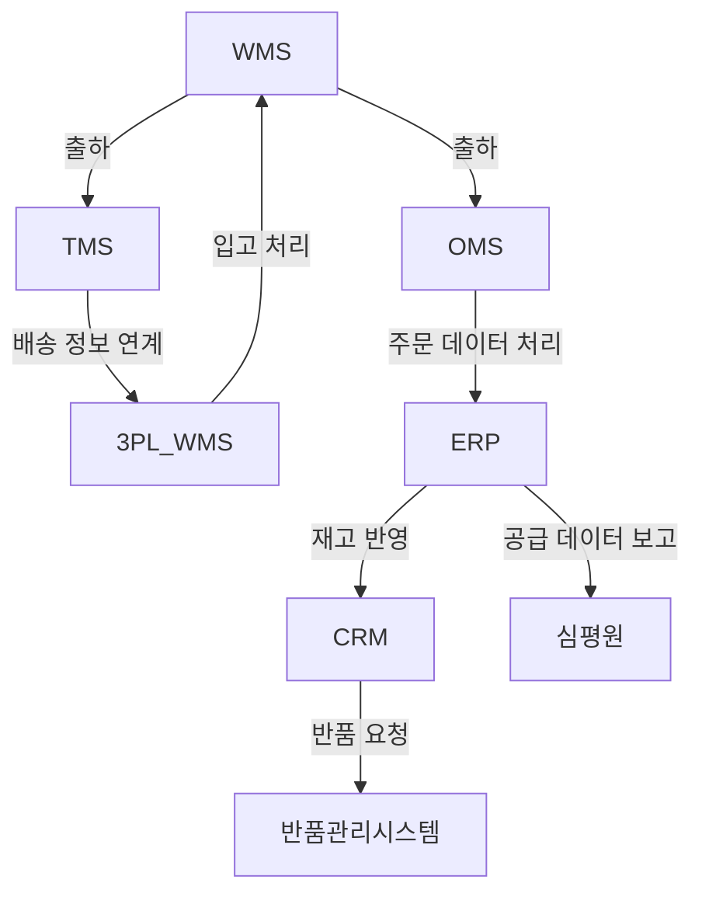

## 1️⃣ 프로젝트 개요
### ✅ 목표
본 문서는 **제약사 그룹사의 물류 프로세스 중 창고 보관 이후의 정상적인 운영 단계에서 사용되는 시스템을 분석**하는 것을 목표로 한다.  
이를 통해 **각 단계에서 활용되는 시스템을 명확히 정의하고, 시스템 간 연계성을 분석하여 최적화를 위한 기반을 마련**한다.

### ✅ 분석 범위
본 분석은 **제약 물류 프로세스 중 고객 주문 이후 창고 보관부터 시작하여, 생산 실적 보고까지의 전 과정**을 대상으로 한다.

📌 **BPR 적용 대상 프로세스 (고객 주문 이후 시점부터 개선)**
- **4. 창고 보관 (Warehouse & Inventory Management)**
- **5. 거점 창고 이동 (3PL)**
- **6. 병원/약국/도매업체 출하 (Distribution & Shipping)**
- **7. 소비자 전달 및 반품 (Returns & Recall Process)**
- **8. 생산 실적 보고 (Reporting & Compliance)**

---

## 2️⃣ 정상 프로세스에서 사용되는 단계별 시스템 분석
본 분석에서는 **각 단계에서 사용되는 주요 시스템을 정의하고, 해당 시스템의 역할을 설명**한다.

### 📌 단계별 사용 시스템
| 단계 | 사용 시스템 | 시스템 역할 |
|---|---|---|
| **4. 창고 보관** | **WMS (창고관리시스템)** | - 창고 내 재고 이동 및 보관 관리<br>- **2D 바코드 스캔을 통한 재고 추적**<br>- **FEFO(First Expired, First Out) 적용**하여 유통기한 기반 출하 |
| **5. 거점 창고 이동 (3PL)** | **TMS (운송관리시스템), 물류센터 WMS** | - **거점 창고로 이동 시 TMS와 연동하여 운송 최적화**<br>- **거점 창고 도착 시 2D 바코드 스캔 후 WMS 재고 반영** |
| **6. 병원/약국/도매업체 출하** | **TMS, OMS (주문관리시스템), ERP** | - **OMS를 통한 주문 접수 및 출하 관리**<br>- **TMS 연계를 통한 실시간 배송 상태 모니터링**<br>- ERP와 연계하여 **재고 감소 반영 및 회계 처리** |
| **7. 소비자 전달 및 반품** | **ERP, CRM (고객관리시스템), 반품관리 시스템** | - **병원 및 약국에서 출하 상태 실시간 확인**<br>- **반품(환입) 발생 시 반품 시스템에서 유통이력 추적**<br>- CRM 연계를 통해 **소비자 대상 리콜 알림 가능** |
| **8. 생산 실적 보고** | **WMS, ERP, 심평원 연계 시스템** | - **출하된 의약품 정보를 WMS와 ERP에서 집계 후 심평원에 자동 보고**<br>- **리콜 발생 시 국가 보고 시스템과 연계하여 데이터 제출** |

---

## 3️⃣ 시스템 연계 흐름도
본 단계에서는 **정상적인 프로세스에서 시스템 간 연계를 도식화하여 가시성을 높인다.**



```mermaid
  info
```